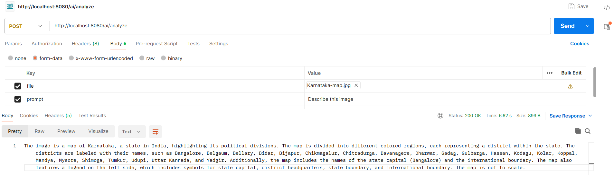

# Procedure for Connecting springboot with Ollama locally
1) download Software(like Ollama ≈ 2gb) & its model(like llama3.2:1b ≈ 1.3gb) locally
2) add dependnecy in pom.xml (like ollama)
3) impl that model in application.properties

# Procedure for Connecting springboot with OpenAI
1) Go to openAi & create access key
2) add dependnecy in pom.xml (like genai)
3) impl free model in application.properties

# Procedure for Connecting springboot with GenAI
1) Go to GenAi & create access key
2) add dependnecy in pom.xml (like opnenai)
3) impl free model in application.properties

# Procedure for Connecting springboot with Bedrock
1) Create IAM users (like bedrock-user) & give FullAccessBedrock permission
2) In Which Create Access Key then after collect access-key & seceret-key
3) put access-key & seceret-key in application.properties file in springboot project

